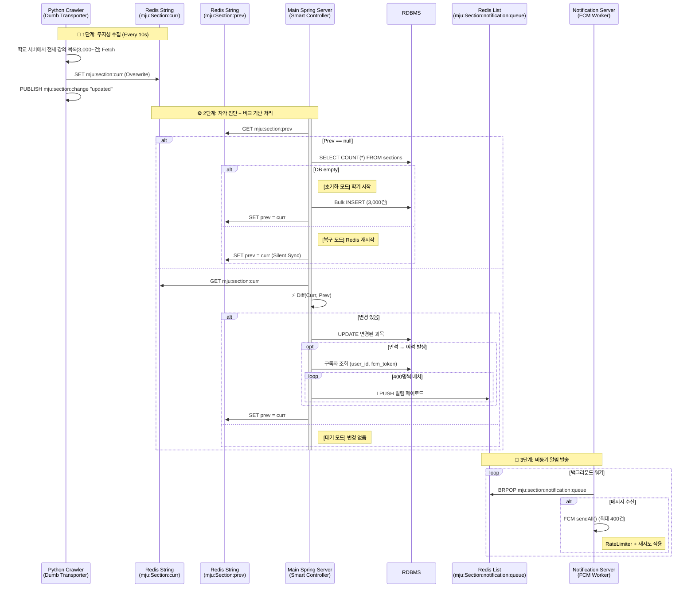
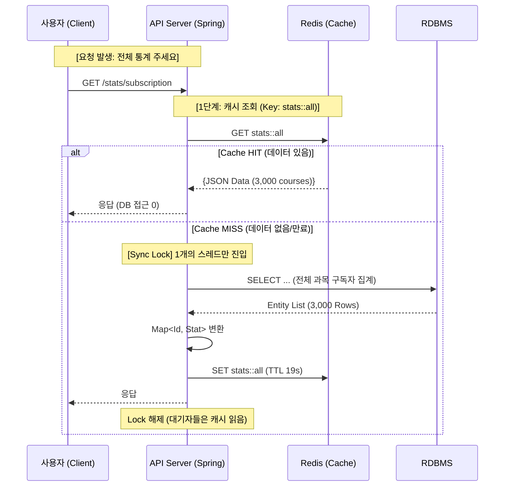
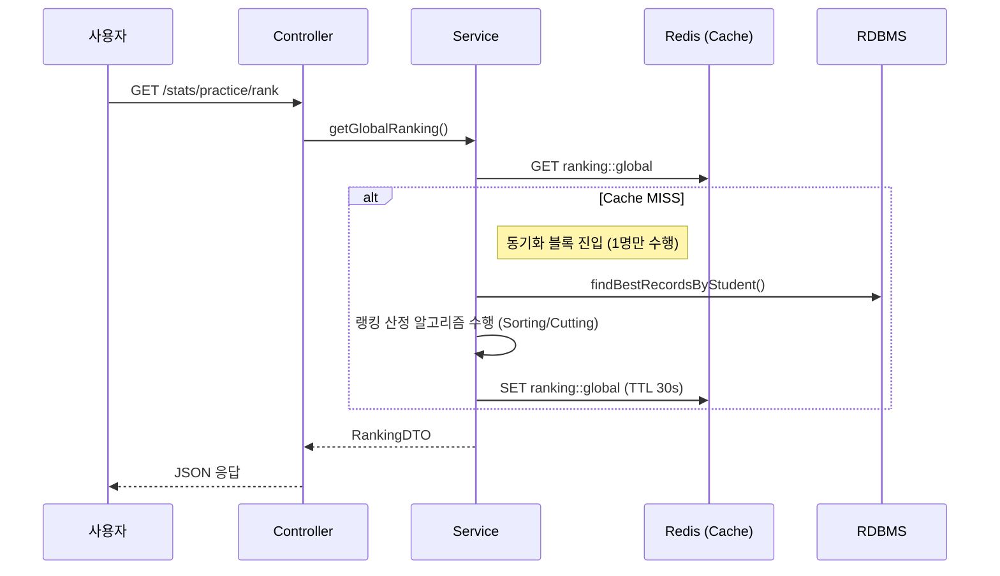
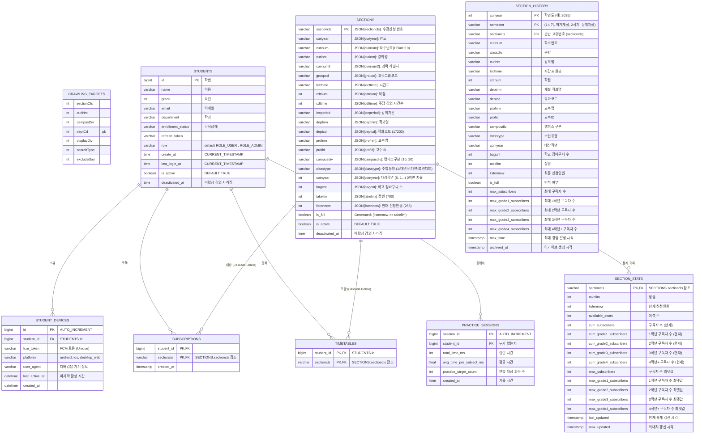

mju-sugangsincheong-helper.mmv.kr
### 프로젝트 목표 및 기능
학생들이 명지대 수강신청시에 발생하는 여러 불편한점을 해결한다
1. 여석 알림 기능 ( 사용자는 과목을 구독하고 만석에서 여석이 발생하면 알림 )
2. 학과별 여석 구독을 한 사람들의 경쟁율
3. 정확한 시간표 짜기 기능 - 에브리타임의 시간표가 틀린경우가 많아 이를 대체
4. 추후 : 수강신청 연습 ( 대부분 프론트 이지만 다른 사용자들과의 랭킹 기능을 위해 약간의 백엔드 기능이 필요 )

### 아키텍처 전체 구성 미들웨어를 중심
공유기 -> bare machine nginx (여기까지 ssl) -> docker niginx 프론트 -> docker compose (spring, redis, db)

docker niginx 프론트의 로그를 남기기위한 방법
- nginx(front(vue.js), `/api` 시작하는 url 은 뒷단의 docker container 2 로 프록시)
- docker compose 로 구성
	- docker container 1 (fast api crawler)
	- docker container 2 (main spring server)
	- docker container 3 (spring notification server)
	- docker container 4 (redis)
	- docker container 5 (RDBMS)
- 의존성 (의존하더라도 터지지는 않아야함)
	- front : backend
	- backend : redis, db
	- crawler : redis
	- notification : redis
### 회원가입, 로그인 및 로그인 유지

D-Day (로그인 시점): 사용자(PW 입력) → 우리서버 → 명지대서버(검증) → 우리서버(토큰발급)  
D+1 ~ D+13 (사용 기간): 사용자(토큰) → 우리서버(db확인) → 통과 (명지대서버 안감)  
D+14 (만료): 사용자(토큰) → 우리서버(db만료됨) → 로그아웃 (사용자가 다시 로그인해야 함)

명지대 아이디 비밀번호를 그대로 사용하여 로그인과 회원가입의 경계가 없도록 한다
만약 User Table 에 없으면(회원가입이 안되어 있으면), 사용자에게 받은 아이디와 비밀번호를 바로 이곳에 요청해서 받아서 UserTable 을 채운다
https://mju-univ-auth.shinnk.mmv.kr/openapi.json

```bash
curl -X 'POST' \
  'https://mju-univ-auth.shinnk.mmv.kr/api/v1/student-basicinfo' \
  -H 'accept: application/json' \
  -H 'Content-Type: application/json' \
  -d '{
  "user_id": "학번",
  "user_pw": "비밀번호"
}'
```

```json
{
  "request_succeeded": true,
  "credentials_valid": true,
  "data": {
    "department": "",
    "category": "",
    "grade": "",
    "last_access_time": "",
    "last_access_ip": "",
    "raw_html_data": ""
  },
  "error_code": "",
  "error_message": "",
  "success": true
}
```

으로 먼저 카테로리가 대학, 학번이 60 으로 시작하는지 먼저 확인한다
아니면 학부생이 아니므로 서비스 대상자 아님
다시 요청해서 

```bash
curl -X 'POST' \
  'https://mju-univ-auth.shinnk.mmv.kr/api/v1/student-card' \
  -H 'accept: application/json' \
  -H 'Content-Type: application/json' \
  -d '{
  "user_id": "학번",
  "user_pw": "비밀번호"
}'
```

```json
{
  "request_succeeded": true,
  "credentials_valid": true,
  "data": {
    "student_profile": {
      "student_id": "",
      "name_korean": "",
      "grade": "",
      "enrollment_status": "",
      "college_department": "",
      "academic_advisor": "",
      "student_designed_major_advisor": "",
      "photo_base64": ""
    },
    "personal_contact": {
      "english_surname": "",
      "english_givenname": "",
      "phone_number": "",
      "mobile_number": "",
      "email": "",
      "current_residence_address": {
        "postal_code": "",
        "address": ""
      },
      "resident_registration_address": {
        "postal_code": "",
        "address": ""
      }
    },
    "raw_html_data": ""
  },
  "error_code": "",
  "error_message": "",
  "success": true
}
```

user table 에 학번 pk 가 존재하므로 이제는 jwt 기반 로그인 처리가 되어야 한다

탈퇴는 첫학기에는 그냥 refresh token 을 지우기만 하고 진짜 학생을 지우지 않는다
db 관련 처리가 되어있지 않다

### 알림 기능

본 시스템은 데이터의 **수집(I/O)** 과 **처리(Logic)** 를 철저히 분리하여 안정성을 극대화합니다.



---

#### 1. Python Crawler (The "Dumb" Transporter)
*   **역할:** 데이터 운반자 (Carrier)
*   **운영 주기:** 9초
*   **특징:** 이전 상태를 기억하지 않으며, DB에 접근하지 않습니다. 학교 서버의 응답을 그대로 Redis에 덮어씁니다.
*   **동작:**
    1.  **Fetch:** 학교 서버에서 전체 강의 목록(3,000건)을 조회합니다.
    2.  **Overwrite:** 가져온 리스트를 JSON 문자열로 직렬화하여 Redis `mju:section:curr` 키에 `SET` 합니다.
    3. PUBLISH `mju:section:change` "updated"  하여 이벤트를 발생시킵니다
               *   이전 데이터가 무엇이든 상관없이 무조건 덮어씁니다.

#### 2. Main Spring Server (The "Smart" Controller)
*   **역할:** 데이터 동기화 및 알림 결정 (Coordinator)
*   **특징:** `Curr`(현재)와 `Prev`(과거)를 비교하여 변경사항을 감지하고, DB 최신화 및 알림 발송을 수행합니다.
*   **동작 프로세스:**
    1. **event**:  RedisPubSubConfig 클래스를 통해 미리 `mju:section:change` 를 구독하다가 이벤트가 발생하면 아래 로직을 실행합니다
    2. **Load:** Redis에서 GET `mju:section:curr`와 GET `mju:section:prev` 두 값을 가져옵니다.
    3.  **Sync:** `curr`의 값을 `prev`에 덮어씌워(`SET`), 다음 턴의 비교 기준으로 삼습니다.
    4.  **Comparison (Diff):** 두 JSON을 Java Object(Map)로 변환하여 메모리 상에서 비교합니다.
    5.  **Action:**
        *   **변경 없음:** 로직을 즉시 종료합니다. (DB 접근 없음)
        *   **변경 있음:** 변경된 과목에 대해 DB `UPDATE`를 수행하고, `is_full`이 `True` -> `False`로 변한 경우 `SELECT user_id, email, fcm_token FROM SUBSCRIPTIONS JOIN USERS ...` 하여 알림을 보낼 인원을 추립니다. 추려서  최대 400개씩 잘라서 LPUSH `mju:section:notification:queue` 로 보냅니다

#### 3. Spring Notification Server (Sender)
*   **역할:** 실제 알림 전송 (Worker)
*   **동작:** 수신하면 FCM 서버로 메시지를 전송합니다.
* action : `@PostConstruct` + 백그라운드 스레드 를 통해 BRPOP `mju:section:notification:queue` 을 받아서 멀티 캐스트 방식으로 fcm 으로 전송

---

#### 장애 대비 및 안정성 확보 전략 (Robustness Strategy)

시스템이 비정상 종료되거나 초기화되었을 때, Spring Server 내부에서 수행하는 **자가 치유(Self-Healing)** 로직입니다.

##### A. 데이터 상태별 대응 매트릭스

Spring 서버가 `mju:section:prev`를 조회했을 때의 결과(`Null` 여부)와 DB 상태를 조합하여 행동을 결정합니다.

| `Prev` (과거)   | DB 상태           | `Curr` vs `Prev` | 판단 및 행동 (Action)                                   | 비고               |
| :------------ | :-------------- | :--------------- | :------------------------------------------------- | :--------------- |
| **없음 (Null)** | **없음 (Empty)**  | -                | **초기화 (Init):** DB 전체 Insert, 알림 X, `prev` 갱신      | 학기 시작 / 서버 최초 기동 |
| **없음 (Null)** | **있음 (Exists)** | -                | **복구 (Recovery):** 무시 (Pass), `prev` 갱신            | Redis 재시작 상황     |
| **있음**        | (무관)            | **같음 (Same)**    | **대기 (Idle):** 아무것도 안 함                            | 평온한 상태 (대부분의 시간) |
| **있음**        | (무관)            | **다름 (Diff)**    | **처리 (Process):** 변경분 DB 반영, 여석 발생 시 알림, `prev` 갱신 | 이벤트 발생!          |

| Case | Redis `Prev` 상태 | DB `Sectionn` 상태 | 판단 상황 | 대응 액션 (Action) |
| :--- | :--- | :--- | :--- | :--- |
| **1** | **Null** (없음) | **Empty** (0건) | **서비스 초기 구축 / 학기 시작** | **[초기화 모드]** Bulk Insert 수행 |
| **2** | **Null** (없음) | **Exists** (데이터 있음) | **Redis 장애 복구 / 재시작** | **[복구 모드]** 변경 무시 (Silent Recovery) |
| **3** | **Not Null** (있음) | (무관) | **정상 운영 중** | **[비교 모드]** Diff 수행 및 알림 발송 |

##### B. 시나리오별 상세 로직

###### 1. 초기화 모드 (Init Mode) - `Case 1`
*   **상황:** 관리자가 수강신청 시작 전 `SectionS` 테이블을 비웠습니다 Redis도 비어있는 상태.
*   **문제:** 3,000개 과목이 모두 "새로운 과목"으로 인식되어, 3,000건의 알림 폭탄이 발생할 위험이 있음.
*   **해결 로직:**
    1.  `prev`가 Null이고, `count(db.section) == 0`임을 감지합니다.
    2.  `curr` 데이터를 기반으로 DB에 **Bulk Insert**를 수행합니다.
    3.  **중요:** **알림 발송 로직을 강제로 건너뜁니다 (Skip Notification).**
    4.  `curr` 데이터를 `prev`에 저장합니다.
    *   **결과:** DB 데이터 적재 완료, 알림 미발송, 다음 턴부터 정상 비교 시작.

###### 2. 복구 모드 (Recovery Mode) - `Case 2`
*   **상황:** 운영 중 Redis 컨테이너가 재시작되어 메모리 데이터(`prev`)가 날아감. DB에는 정상 데이터가 있음.
*   **문제:** 기준점(`prev`)이 사라져서, 현재 데이터(`curr`)와 비교할 대상이 없음.
*   **해결 로직:**
    1.  `prev`가 Null이지만, DB에는 데이터가 있음을 확인합니다.
    2.  `curr` 데이터를 기반으로 DB에 **Bulk Insert**를 수행합니다.
    3.  `curr` 데이터를 `prev`에 저장만 하고 종료합니다.
    *   **이유:** DB와 비교를 시도할 수도 있지만, 미세한 시점 차이로 인한 오동작을 방지하기 위해 1회(10초)의 변경사항 누락을 감수하고 시스템의 **기준점 복구**를 최우선으로 합니다.
    *   **결과:** 10초 뒤 다음 턴에서는 `prev`가 존재하므로 정상적으로 `Case 3`로 진입합니다.

###### 3. 정상 비교 모드 (Normal Mode) - `Case 3`
*   **상황:** `prev`와 `curr`가 모두 존재함.
*   **동작:**
    1.  **If `curr` == `prev`:**
        *   아무 일도 하지 않습니다. DB Connection조차 맺지 않습니다. (Zero Cost)
    2.  **If `curr` != `prev`:**
        *   두 JSON을 파싱 하여 **변경된 과목 리스트(`Delta`)**를 추출합니다.
        *   `Delta`에 해당하는 과목들만 DB에 `UPDATE` 쿼리를 날립니다.
        *   `Delta` 중 **[만석(`prev.full=true`) -> 여석(`curr.full=false`)]** 조건에 맞는 과목을 필터링하여 알림 서버로 전송합니다.
        *   로직 종료 직전, `curr` 값을 `prev` 키에 덮어씁니다.

##### C. 외부 요인 방어 (Safety Valves)

1.  **크롤러 지연 (Lag) 대응**
    *   Spring은 항상 Redis의 `mju:section:curr` 키를 읽습니다. 이 키는 Queue처럼 쌓이는 것이 아니라, 크롤러가 가장 마지막에 성공한 데이터로 **항상 덮어쓰여져 있습니다.**
    *   따라서 처리가 지연되어도 밀린 데이터를 처리하느라 허덕이지 않고, 항상 **"현재 시점의 최신 데이터"**만 처리하게 됩니다.

2.  **학교 서버 오류 대응**
    *   크롤러가 학교 서버 접속 실패 시, Redis의 `curr` 값을 갱신하지 않습니다.
    *   Spring은 `prev`와 동일한 오래된 `curr`를 읽게 되거나(갱신 시간이 없다면), 갱신 타임스탬프를 확인하여 처리를 건너뛸 수 있습니다.
    *   결과적으로 잘못된 데이터(빈 값 등)로 DB가 오염되는 것을 방지합니다.

| 상황                      | 처리 방식                                         |
| ----------------------- | --------------------------------------------- |
| `curr`에 있고, `prev`에도 있음 | 기존대로 필드 업데이트                                  |
| `curr`에 없고, `prev`에 있음  | `is_active = false`, `deactivated_at = NOW()` |
| `curr`에 있고, `prev`에 없음  | 신규 강의 → INSERT                                |


- `is_active = true`: 정상 노출 강의
- `is_active = false`: 폐강 또는 숨김 처리된 강의

네, **"개별 조회 없이 오직 전체 스냅샷(Global Snapshot)만 제공한다"**는 점을 명확히 하여 해당 내용을 정리해 드립니다.

---

### 구독 통계 시스템 (Subscription Statistics)

**"모든 과목의 통계를 한 번에 내려준다. 필터링은 프론트엔드가 알아서 한다."**
서버는 개별 과목에 대한 통계 API를 제공하지 않습니다. 대신, 요청 시점에 존재하는 3,000여 개 과목의 전체 통계를 하나의 거대한 JSON으로 반환합니다.

- **전략:** Cache-Aside (Look Aside) + Synchronized Loading
- **캐시 이름:** `stats`
- **Key 전략:** 고정된 단일 키 (`'all'`) 사용
- **TTL (유효시간):** 19초
- **보호 메커니즘:** `@Cacheable(sync = true)` (Thundering Herd 방지)

#### 1. 아키텍처 및 데이터 흐름

1. **TO-BE :**
    1.  사용자가 통계 API를 호출하면 **`stats::all`** 캐시를 확인합니다.
    2.  **Cache Miss (데이터 없음/만료):** 순간적으로 수천 명의 요청이 몰려도, **단 하나의 스레드**만 DB에 접근하여 전체 집계를 수행합니다(`sync=true`). 나머지 요청은 대기합니다.
    3.  **Cache Hit (데이터 있음):** 메모리에 저장된 거대 JSON을 즉시 반환합니다.



#### 2. 데이터 구조 (Response Example)

단일 API 응답에 모든 데이터가 포함됩니다. (Payload 크기: 약 500KB ~ 1MB)

```json
{
  "6223": { 
    "total":  { "curr": 150, "max": 200 }, 
    "grade1": { "curr": 20,  "max": 30 }, 
    "grade2": { "curr": 40,  "max": 50 }, 
    "grade3": { "curr": 80,  "max": 110 }, 
    "grade4": { "curr": 10,  "max": 10 }
  },
  "6224": { 
    "total":  { "curr": 12, "max": 15 }, 
    // ... 생략
  },
  // ... 3,000개 과목 반복
  "updated_at": 1707700000 
}
```

#### 3. 핵심 로직 구현 (Service Layer)

개별 조회 메서드는 존재하지 않으며, 오직 전체 조회 메서드 하나만 캐싱 처리됩니다.

```java
@Service
@RequiredArgsConstructor
public class StatisticsService {

    private final StatsRepository statsRepository;

    /**
     * 전체 구독 통계 조회 (Global Snapshot)
     * - 개별 과목 조회 로직 없음. 무조건 전체 반환.
     * - value: "stats" (TTL 19초)
     * - key: "'all'" (모든 사용자가 동일한 데이터를 보므로 고정 키 사용)
     * - sync: true (DB 보호를 위한 동기화)
     */
    @Cacheable(value = "stats", key = "'all'", sync = true)
    public Map<String, StatDto> getSubscriptionStats() {
        // 1. DB 전체 집계 (Cache Miss일 때만, 단 한 번 실행)
        //    쿼리: SELECT section_id, ... FROM section_stats
        List<StatDto> stats = statsRepository.aggregateAll();

        // 2. 프론트엔드에서 O(1)로 찾기 편하게 Map으로 변환
        return stats.stream()
            .collect(Collectors.toMap(StatDto::getSectionId, Function.identity()));
    }
}
```

### 수강신청 연습 시스템 (Practice Ranking)

**"랭킹 산정은 비싸다. 하지만 실시간성이 필요하다. 30초의 타협."**
- **전략:** Cache-Aside + Synchronized Loading
- **캐시 이름:** `ranking`
- **TTL (유효시간):** 30초

##### A. 전체 랭킹
최상위에 `updated_at`을 두고, 장바구니 개수(`count_N`)별로 데이터를 묶습니다.

```json
{
  "updated_at": 1707782400000,
  "data": {
    "count_1": {  // [1과목 담기 챌린지]
      "total": [  // 전체 Top 100
        { "rank": 1, "name": "김*수", "dept": "컴공", "time": 1200 },
        { "rank": 2, "name": "이*희", "dept": "경영", "time": 1240 }
      ],
      "dept": {   // 학과별 Top 10
        "컴퓨터공학과": [ { "rank": 1, "name": "김*수", "time": 1200 }, ... ],
        "경영학과": [ ... ]
      },
      "grade": {  // 학년별 Top 10
        "1": [ ... ],
        "2": [ ... ]
      }
    },
    "count_2": { ... }, // [2과목 담기 챌린지]
    "count_3": { ... }  // ...
    ...
  }
}
```

##### B. 개인별 기록 
특정 학생(예: `60191234`)이 조회했을 때, 자신이 참여했던 모든 종목(과목 수)의 최고 기록과 **현재 등수**를 보여줍니다.

```sql
-- [개념적 쿼리] 모든 로그를 가져오지 않고, 각 학생의 장바구니 개수(count_num)별 '최고 기록'만 가져옴
SELECT p.* 
FROM practice_sessions p
JOIN (
    SELECT student_id, count_num, MIN(time_ms) as min_time
    FROM practice_sessions
    GROUP BY student_id, count_num
) best_on_group
ON p.student_id = best_on_group.student_id 
   AND p.count_num = best_on_group.count_num 
   AND p.time_ms = best_on_group.min_time;
```

```json
{
  "updated_at": 1707782400000,
  "student_id": 60191234,
  "records": {
    "count_3": { 
      "best_time_ms": 1500,     // 내 최고 기록
      "total_rank": 45,         // 전체 등수 (없으면 null)
      "dept_rank": 5,           // 학과 내 등수
      "grade_rank": 10          // 학년 내 등수
    },
    "count_6": {
      "best_time_ms": 3200,
      "total_rank": 12,
      "dept_rank": 1,
      "grade_rank": 3
    }
  }
}
```

#### 1. 아키텍처 및 데이터 흐름

랭킹 산정 로직은 DB 부하가 크기 때문에(Group By, Window Function 등), 사용자가 버튼을 누를 때마다 계산하면 DB가 뻗어버립니다. 이를 방지하기 위해 30초 동안은 **"스냅샷"** 을 보여줍니다.



#### 2. 핵심 로직 구현 (Service Layer)

전체 랭킹(`global`)과 개인 기록(`me`)을 분리하여 캐싱 전략을 다르게 가져갈 수도 있지만, 여기서는 일관성을 위해 동일한 설정(`ranking` 그룹)을 사용합니다.

```java
@Service
@RequiredArgsConstructor
public class PracticeService {

    private final PracticeRepository practiceRepository;

    /**
     * [전체 랭킹 조회]
     * - 연산 비용이 높음 (전체 데이터 로드 및 정렬)
     * - 30초에 한 번만 실제 연산 수행
     */
    @Cacheable(value = "ranking", key = "'global'", sync = true)
    public Map<String, Object> getGlobalRanking() {
        // 1. [DB 최적화] 학생별 최고 기록만 조회
        List<PracticeSession> bestLogs = practiceRepository.findBestRecordsByStudent();

        // 2. [메모리 연산] 과목 수 별 그룹핑 및 랭킹 산정 로직
        Map<String, Object> globalData = new HashMap<>();
        // ... (랭킹 산정 복잡한 로직) ...
        
        return globalData;
    }

    /**
     * [내 기록 조회]
     * - 개인별 캐싱 (key = 학번)
     * - 전체 랭킹보다는 가볍지만, 빈번한 호출 방지
     */
    @Cacheable(value = "ranking", key = "'user:' + #studentId", sync = true)
    public UserRecordMap getMyRecord(Long studentId) {
        // 해당 학생의 모든 기록 조회 및 분석
        return practiceRepository.findRecordsByStudentId(studentId);
    }
}
```

---

### Redis 캐시 설정 (Infrastructure)

위의 `@Cacheable`이 의도대로 동작하기 위해, **TTL 설정**과 **직렬화**를 담당하는 설정 파일입니다. 제공해주신 코드를 기반으로 이 아키텍처에 맞게 상세화되었습니다.

```java
@Configuration
@EnableCaching // [핵심] 어노테이션 기반 캐싱 활성화
@RequiredArgsConstructor
public class RedisConfig {

    private final RedisConnectionFactory connectionFactory;

    // ... (JSON Serializer 설정 부분 동일) ...

    /**
     * [CacheManager 설정]
     * 각 캐시 이름(CacheName)별로 만료 시간(TTL)을 다르게 제어합니다.
     */
    @Bean
    public CacheManager cacheManager() {
        // 1. 기본 설정 (Default): TTL 60초
        RedisCacheConfiguration defaultConfig = RedisCacheConfiguration.defaultCacheConfig()
                .disableCachingNullValues()
                .entryTtl(Duration.ofSeconds(60))
                .serializeKeysWith(RedisSerializationContext.SerializationPair.fromSerializer(new StringRedisSerializer()))
                .serializeValuesWith(RedisSerializationContext.SerializationPair.fromSerializer(jsonSerializer()));

        // 2. 캐시 이름별 커스텀 TTL 설정
        Map<String, RedisCacheConfiguration> ttlConfigs = new HashMap<>();

        // [A] 구독 통계 ("stats"): 19초
        // 이유: 수강신청 기간에는 경쟁률이 1분 1초가 다르게 변하므로 비교적 짧게 가져감
        ttlConfigs.put("stats", defaultConfig.entryTtl(Duration.ofSeconds(19)));

        // [B] 수강신청 연습 랭킹 ("ranking"): 30초
        // 이유: 랭킹 집계 쿼리는 무거우므로 DB 보호를 위해 텀을 조금 더 길게 둠
        ttlConfigs.put("ranking", defaultConfig.entryTtl(Duration.ofSeconds(30)));

        return RedisCacheManager.builder(connectionFactory)
                .cacheDefaults(defaultConfig)
                .withInitialCacheConfigurations(ttlConfigs)
                .build();
    }
    
    // ... (RedisTemplate 및 Pub/Sub 설정은 기존 알림 로직을 위해 유지) ...
}
```

### 프론트엔드 최적화
이 방식은 한 번 요청할 때 데이터가 큽니다(수백 KB ~ 수 MB).
따라서 **프론트엔드(Vue.js)** 에서는 `/stats` 캐싱(1분 저장) 을 통해 관리

### 수강신청기간 안전 설계
#### 3-Tier "On-Demand" 격리 모델
1. 일정은 별도의 정적 파일 서버(mju-sugangsinchenong-schedule.shinnk.c01.kr)에서 관리되며, 이것이 유일한 진실(Single Source of Truth)입니다.
2.  **상태 확인:** 프론트엔드가 **"일정(Schedule)"** 과 **"서버 생존(Redis)"** 을 조합하여 최종 UI를 결정.
3. 만약 프론트엔드 로직이 이상해서 강제로 백에 요청하더라도 그냥 백은 올바르게 동작 그냥 로직 처리(안전 설계)

---

#### 1. Tier 1: Worker (Python Crawler)
**역할:** 스케줄을 받아와서 일하고, 생존 신고를 하는 **공급자**.

*   **동작 방식:**
    1.  **일정 로딩:** 시작 시 `https://mju-sugangsinchenong-schedule.shinnk.c01.kr/schedule.json`을 요청하여 일정 로드.
    2.  **크롤링:** 일정 시간에 맞춰 학교 서버 크롤링.
    3.  **생존 신고:** 작업 성공 시 Redis에 `mju:system:status` 키를 `SET` (TTL 60초).
*   **단순화:**
    *   스스로 판단하지 않음. 배포된 프론트엔드의 설정 파일을 따름.

#### 2. Tier 2: Server (Spring Boot)
**역할:** Redis만 확인하고 즉답해주는 **단순한 심판**.

*   **상태 확인 API (`/api/v1/system/status`):**
    *   **스케줄 모름:** 이 서버는 현재가 수강신청 기간인지 아닌지 **전혀 모름.**
    *   **로직:** 오직 Redis에 `mju:system:status` 키가 있는가?
        *   **있음:** `running: true`
        *   **없음:** `running: false`
    *   **특징:** 코드 복잡도 0에 수렴.
*   **데이터 제공 API:**
    *   DB에 있는 데이터를 있는 그대로 조회해서 반환.

#### 3. Tier 3: Client (Vue.js)
**역할:** 스케줄을 알고 있고, 상황을 종합 판단하는 **지휘관**.

*   **동작 방식 (Page Entry):**
    *   **일정 로딩:** 시작 시 `https://mju-sugangsinchenong-schedule.shinnk.c01.kr/schedule.json`을 요청하여 일정 로드.
    *   **Step 1:** `/api/v1/system/status` 호출하여 "크롤러가 살아있는가?" 확인.
    *   **Step 2 (UI 결정):**
        *   **기간 O + Running True:** 🟢 "실시간 업데이트 중"
        *   **기간 O + Running False:** 🟡 "연결 지연 (마지막 데이터 표시)"
        *   **기간 X:** 🔴 "운영 시간이 아니므로 실시간 데이터가 아닙니다"
*   **캐시 정책:**
    *   페이지 진입 시마다 재확인.

#### 실행 시나리오 재구성

##### 상황 1: 사용자가 "수강신청 연습" 페이지 진입
1.  **Vue:** 이 기능은 학교 서버 상태랑 상관없음.
2.  **Action:** API 상태 체크 **안 함**.
3.  **Result:** 로컬 로직으로 기능 수행.

##### 상황 2: 사용자가 "구독" 페이지 진입 (운영 중, 정상)
1.  **Vue:** `schedule.json` 확인 -> "지금은 ICT 공대 신청 기간임".
2.  **Vue:** `/api/status` 호출 -> `running: true` 수신.
3.  **Result:** 🟢 **"실시간 정보 (ICT 공대)"** 배너 표시 및 데이터 로딩.

##### 상황 3: 사용자가 "구독" 페이지 진입 (운영 중, 크롤러 장애)
1.  **Vue:** `schedule.json` 확인 -> "지금은 ICT 공대 신청 기간임".
2.  **Vue:** `/api/status` 호출 -> `running: false` 수신 (Redis 키 없음).
3.  **Result:**  🟡 **"일시적 연결 지연"** 배너 표시.
    *   사용자는 "기간은 맞는데 서버가 좀 아프구나"라고 정확히 인지.
    *   DB에 남아있는 마지막 데이터는 정상적으로 보여줌.

##### 상황 4: 새벽 시간에 접속
1.  **Vue:** `schedule.json` 확인 -> "지금은 운영 시간이 아님".
2.  **Result:** 🔴 **"운영 종료 (다음 일정: 2/24)"** 배너 표시. 서버 호출 안 함.

---

#### schedule.json
[schedule json 파일](https://mju-sugangsincheong-schedule.shinnk.c01.kr/schedule.json)  
[test-schedule.json 파일](https://mju-sugangsincheong-schedule.shinnk.c01.kr/test-schedule.json)  

```json
{
  "utcOffset": "+09:00",
  "schedules": [
    {
      "name": "장바구니(미리담기) 기간",
      "dateStart": "2026-02-02",
      "dateEnd": "2026-02-06",
      "timeStart": "10:30",
      "timeEnd": "16:45",
      "crawlIntervalSec": 30,
      "notifyEnabled": false
    },
    {
      "name": "ICT 공과대학 수강신청",
      "dateStart": "2026-02-13",
      "dateEnd": "2026-02-13",
      "timeStart": "10:30",
      "timeEnd": "16:45",
      "crawlIntervalSec": 9,
      "notifyEnabled": true
    },
    {
      "name": "전학년/전학과 수강신청",
      "dateStart": "2026-02-24",
      "dateEnd": "2026-02-24",
      "timeStart": "10:30",
      "timeEnd": "16:45",
      "crawlIntervalSec": 9,
      "notifyEnabled": true
    },
    {
      "name": "수강신청 변경(정정) 기간",
      "dateStart": "2026-03-03",
      "dateEnd": "2026-03-06",
      "timeStart": "10:30",
      "timeEnd": "17:45",
      "crawlIntervalSec": 9,
      "notifyEnabled": true
    }
  ]
}
```

### RDBMS ERD



### ERD 주요 포인트

1. **`SUBSCRIPTIONS` / `TIMETABLES`**:  
   `SECTIONS.id`를 외래키(FK)로 참조하며, **`ON DELETE CASCADE`** 제약 조건을 적용했습니다.  
   → 학기 전환 시 `SECTIONS` 테이블을 `TRUNCATE` 또는 `DELETE`하면, 해당 분반을 구독하거나 시간표에 등록한 사용자 데이터가 **자동으로 정리**되어 불필요한 고아(orphan) 레코드가 남지 않습니다.

2. **통계 조회 성능 최적화를 위한 인덱스 권장**:

   ```sql
   CREATE INDEX idx_sections_deptcp on SECTIONS(deptcd);   -- 학과별 통계용
   CREATE INDEX idx_sections_curinum on SECTION(curinum); -- 과목(학수번호)별 통계용
   CREATE INDEX idx_sections_comyear ON SECTIONS(comyear);-- 대상학년별 통계용
   ```

   > 💡 `deptcd`, `curinum`, `comyear`는 모두 크롤링 원본 필드명과 일치시키며, 집계 쿼리 성능을 위해 선택적 인덱싱합니다.

3. **학과 정보 저장 방식**:  
   - `STUDENTS.department`는 **사용자의 소속 학과명** (예: "컴퓨터공학과")을 나타냅니다.  
   - `SECTIONS.deptnm` / `deptcd`는 **강의 개설 학과**를 의미합니다.  
   → 두 필드는 도메인적으로 다르며, **모두 정적 마스터 데이터**입니다.  
   → 별도의 `DEPARTMENTS` 테이블을 두지 않고 **직접 저장**함으로써 **JOIN 없이 빠른 읽기 성능**을 확보했습니다.  
   → 이는 수강신청 시스템처럼 **읽기 중심**(read-heavy)이며, 학과 목록이 자주 변경되지 않는 환경에서 적합한 설계입니다.

### 관리자 계정 및 기능

- 기능 1: 시스템 강제 초기화 (Disaster Recovery)
- 기능 2: 크롤러 헬스 체크 (Monitoring) `SET mju:crawler:heartbeat {timestamp}`

### 추가
1. main spring 서버와 notification 서버는 논리적으로는 2개로 분리되어 있지만 물리적으로 1개로 유지 향후 서비스가 커지면 2개로 분리할 생각이 있음

### 추후
1. 현재 수강신청 연습이 단순히 **"실패" 개념이 없고**, 사용자는 단순히 **과목을 클릭하는 행위만 수행**하며, 그 **반응 속도**(reaction time)만 측정되는데 수강신청 2시간 전부터 5분마다 실제 사용자들이 참여 할 수 있도록 하는 real 연습을 하고 싶다 이것은 완전히 프로젝트를 분리하여 이것과 완전히 분리하는것이 좋아 보임
2.  redis 가 현재 이벤트 처리만을 담당하고 있는데 **"캐싱 계층(Caching Layer)"** 및 **"연산 저장소"** 로 확장
3. kafka 도입을 통해 모든 사용자-시스템 통신과정을 모두 기록하면서 향후 사용자들의 데이터를 통해 언제 구독을 하는지, 언제 여석이 나는지등을 분석하는 머신러닝 프로젝트 확장 가능

### 아키텍쳐 이유
수강신청 알림 특성상 **데이터의 영속성(Persistence)보다 실시간성(Latency)이 더 중요** 하다고 판단 크롤러가 주기적으로 최신 상태를 갱신하므로 일시적인 메시지 유실은 시스템 전체 정합성에 치명적이지 않아, 운영 비용이 낮고 속도가 빠른 **Redis**를 선택
